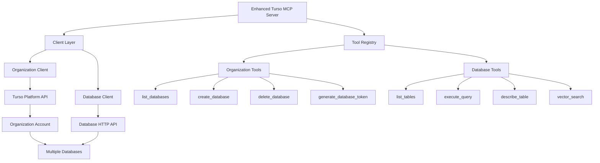
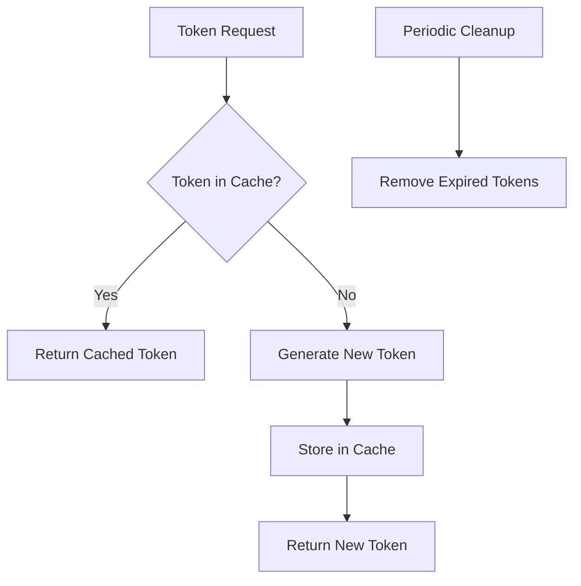

# Turso MCP Server with Account-Level Operations

## Architecture Overview



## Two-Level Authentication System

The Turso MCP server will implement a two-level authentication system
to handle both organization-level and database-level operations:

1. **Organization-Level Authentication**

   - Requires a Turso Platform API token
   - Used for listing, creating, and managing databases
   - Obtained through the Turso dashboard or CLI
   - Stored as `TURSO_API_TOKEN` in the configuration

2. **Database-Level Authentication**
   - Requires database-specific tokens
   - Used for executing queries and accessing database schema
   - Can be generated using the organization token
   - Stored in a token cache for reuse

## User Interaction Flow

When a user interacts with the MCP server through an LLM, the flow
will be:

1. **Organization-Level Requests**

   - Example: "List databases available"
   - Uses the organization token to call the Platform API
   - Returns a list of available databases

2. **Database-Level Requests**

   - Example: "Show all rows in table users in database customer_db"
   - Process:
     1. Check if a token exists for the specified database
     2. If not, use the organization token to generate a new database
        token
     3. Use the database token to connect to the database
     4. Execute the query and return results

3. **Context Management**
   - The server will maintain the current database context
   - If no database is specified, it uses the last selected database
   - Example: "Show all tables" (uses current database context)

## Token Management Strategy

The server will implement a sophisticated token management system:



1. **Token Cache**

   - In-memory cache of database tokens
   - Indexed by database name
   - Includes expiration information

2. **Token Generation**

   - Uses organization token to generate database tokens
   - Sets appropriate permissions (read-only vs. full-access)
   - Sets reasonable expiration times (configurable)

3. **Token Rotation**
   - Handles token expiration gracefully
   - Regenerates tokens when needed
   - Implements retry logic for failed requests

## Configuration Requirements

```typescript
const ConfigSchema = z.object({
	// Organization-level authentication
	TURSO_API_TOKEN: z.string().min(1),
	TURSO_ORGANIZATION: z.string().min(1),

	// Optional default database
	TURSO_DEFAULT_DATABASE: z.string().optional(),

	// Token management settings
	TOKEN_EXPIRATION: z.string().default('7d'),
	TOKEN_PERMISSION: z
		.enum(['full-access', 'read-only'])
		.default('full-access'),

	// Server settings
	PORT: z.string().default('3000'),
});
```

## Implementation Challenges

1. **Connection Management**

   - Challenge: Creating and managing connections to multiple
     databases
   - Solution: Implement a connection pool with LRU eviction strategy

2. **Context Switching**

   - Challenge: Determining which database to use for operations
   - Solution: Maintain session context and support explicit database
     selection

3. **Error Handling**

   - Challenge: Different error formats from Platform API vs. Database
     API
   - Solution: Implement unified error handling with clear error
     messages

4. **Performance Optimization**
   - Challenge: Overhead of switching between databases
   - Solution: Connection pooling and token caching

## Tool Implementations

### Organization Tools

1. **list_databases**

   - Lists all databases in the organization
   - Parameters: None (uses organization from config)
   - Returns: Array of database objects with names, regions, etc.

2. **create_database**

   - Creates a new database in the organization
   - Parameters: name, group (optional), regions (optional)
   - Returns: Database details

3. **delete_database**

   - Deletes a database from the organization
   - Parameters: name
   - Returns: Success confirmation

4. **generate_database_token**
   - Generates a new token for a specific database
   - Parameters: database name, expiration (optional), permission
     (optional)
   - Returns: Token information

### Database Tools

1. **list_tables**

   - Lists all tables in a database
   - Parameters: database (optional, uses context if not provided)
   - Returns: Array of table names

2. **execute_query**

   - Executes a SQL query against a database
   - Parameters: query, params (optional), database (optional)
   - Returns: Query results with pagination

3. **describe_table**

   - Gets schema information for a table
   - Parameters: table name, database (optional)
   - Returns: Column definitions and constraints

4. **vector_search**
   - Performs vector similarity search
   - Parameters: table, vector column, query vector, database
     (optional)
   - Returns: Search results

## LLM Interaction Examples

1. **Organization-Level Operations**

   User: "List all databases in my Turso account"

   LLM uses: `list_databases` tool

   Response: "You have 3 databases in your account: customer_db,
   product_db, and analytics_db."

2. **Database Selection**

   User: "Show tables in customer_db"

   LLM uses: `list_tables` tool with database="customer_db"

   Response: "The customer_db database contains the following tables:
   users, orders, products."

3. **Query Execution**

   User: "Show all users in the users table"

   LLM uses: `execute_query` tool with query="SELECT \* FROM users"

   Response: "Here are the users in the database: [table of results]"

4. **Context-Aware Operations**

   User: "What columns does the orders table have?"

   LLM uses: `describe_table` tool with table="orders"

   Response: "The orders table has the following columns: id
   (INTEGER), user_id (INTEGER), product_id (INTEGER), quantity
   (INTEGER), order_date (TEXT)."

## Implementation Phases

1. **Phase 1: Core Infrastructure** ✅ COMPLETED

   - Set up the two-level authentication system
   - Implement token management
   - Create basic organization and database clients
   - Implemented list_databases tool as initial proof of concept
   - Added MCP server configuration

2. **Phase 2: Organization Tools** ✅ COMPLETED

   - Implement list_databases
   - Implement create_database with default group support
   - Implement delete_database
   - Implement generate_database_token
   - Enhanced error handling with detailed API error messages
   - Converted codebase to use snake_case naming conventions
   - Successfully tested all organization tools

3. **Phase 3: Database Tools** ✅ COMPLETED

   - Implement list_tables
   - Implement execute_query
   - Implement describe_table
   - Implement vector_search (basic implementation, requires Turso
     vector extension)
   - Added context management integration
   - Fixed BigInt serialization issues
   - Successfully implemented and tested database tools

4. **Phase 4: Context Management**
   - Implement database context tracking
   - Add support for implicit database selection
   - Improve error handling and user feedback

## Folder Structure

```
src/
├── index.ts                 # Main server entry point
├── config.ts                # Configuration management
├── clients/
│   ├── organization.ts      # Turso Platform API client
│   ├── database.ts          # Database HTTP API client
│   └── token-manager.ts     # Token generation and caching
├── tools/
│   ├── organization.ts      # Organization-level tools
│   ├── database.ts          # Database-level tools
│   └── context.ts           # Context management
└── common/
    ├── types.ts             # Common type definitions
    └── errors.ts            # Error handling utilities
```
