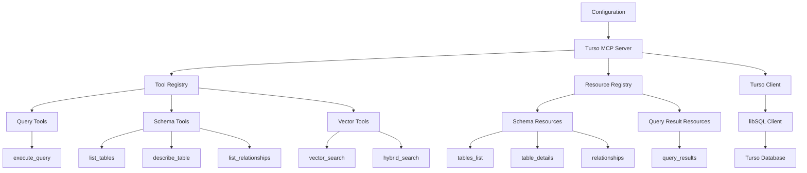

# Turso MCP Server Plan

## Architecture Overview



## Key Components

1. **Unified MCP Server Interface**
   * Single MCP server exposing Turso database capabilities
   * Standardized parameter structure for all tools
   * Support for Turso-specific features

2. **Tool Registry**
   * Registers all database tools with clear, detailed descriptions
   * Highlights capabilities and use cases for each tool
   * Provides comprehensive input schemas

3. **Resource Registry**
   * Exposes database schema information as resources
   * Provides query results as formatted resources
   * Implements resource templates for dynamic access

4. **Turso Client Integration**
   * Wraps the official @libsql/client library
   * Handles connection management and pooling
   * Implements error handling and retry logic

5. **Configuration Management**
   * Environment variable-based authentication
   * Configurable defaults for connection parameters
   * Support for multiple database connections

## Tool Descriptions Strategy

Each tool will have a detailed description explaining:
* What the tool does
* When to use it
* Parameter requirements
* Expected output format
* Limitations or constraints

### Example Tool Descriptions:

**Query Tools:**
* **execute_query**: "Execute SQL queries against a Turso database. Supports parameterized queries for security and complex query structures. Returns formatted results with pagination for large datasets. Best for data retrieval, updates, and schema modifications."

**Schema Tools:**
* **list_tables**: "List all tables in the connected Turso database. Returns table names, row counts, and creation information. Use for database exploration and schema understanding."
* **describe_table**: "Get detailed information about a specific table including columns, types, constraints, and indexes. Provides comprehensive schema details for a single table."
* **list_relationships**: "Discover foreign key relationships between tables in the database. Maps connections between tables for understanding data structure and dependencies."

**Vector Tools:**
* **vector_search**: "Perform semantic similarity search using Turso's vector capabilities. Leverages the DiskANN algorithm for approximate nearest neighbor search. Ideal for finding similar items, semantic matching, and AI-powered search."
* **hybrid_search**: "Combine traditional SQL filtering with vector similarity search. Allows filtering results by regular columns before applying vector similarity, enabling powerful combined queries."

## Implementation Plan

1. **Phase 1: Core Structure**
   * Set up the MCP server framework
   * Implement Turso client integration
   * Create configuration management

2. **Phase 2: Basic Database Tools**
   * Implement schema exploration tools
   * Create query execution functionality
   * Add resource handlers for schema and results

3. **Phase 3: Vector Search Capabilities**
   * Implement vector column detection
   * Add vector search tools
   * Create hybrid search functionality

4. **Phase 4: Advanced Features**
   * Add multi-tenant database support
   * Implement edge computing features
   * Create performance optimizations

5. **Phase 5: Testing & Documentation**
   * Comprehensive testing across features
   * Create detailed documentation
   * Implement example use cases

## Folder Structure

```
src/
├── index.ts                 # Main server entry point
├── config.ts                # Configuration management
├── db/
│   ├── client.ts            # Turso client wrapper
│   ├── connection.ts        # Connection management
│   └── utils.ts             # Database utility functions
├── tools/
│   ├── query.ts             # Query execution tools
│   ├── schema.ts            # Schema exploration tools
│   └── vector.ts            # Vector search tools
├── resources/
│   ├── schema.ts            # Schema-related resources
│   └── query.ts             # Query result resources
└── common/
    ├── types.ts             # Common type definitions
    └── utils.ts             # Shared utility functions
```

## Consumer Tool Selection

The LLM will have clear guidance for tool selection through detailed descriptions:

```typescript
// Example tool registration with detailed description
server.setRequestHandler(ListToolsRequestSchema, async () => ({
  tools: [
    {
      name: 'execute_query',
      description: 'Execute SQL queries against a Turso database. Supports parameterized queries for security and complex query structures. Returns formatted results with pagination for large datasets. Best for data retrieval, updates, and schema modifications.',
      inputSchema: {
        type: 'object',
        properties: {
          query: {
            type: 'string',
            description: 'SQL query to execute'
          },
          params: {
            type: 'object',
            description: 'Query parameters (optional)'
          },
          page_size: {
            type: 'number',
            description: 'Number of results per page (optional)'
          },
          page: {
            type: 'number',
            description: 'Page number to retrieve (optional)'
          }
        },
        required: ['query']
      }
    },
    {
      name: 'vector_search',
      description: 'Perform semantic similarity search using Turso\'s vector capabilities. Leverages the DiskANN algorithm for approximate nearest neighbor search. Ideal for finding similar items, semantic matching, and AI-powered search.',
      inputSchema: {
        type: 'object',
        properties: {
          table: {
            type: 'string',
            description: 'Table containing vector data'
          },
          vector_column: {
            type: 'string',
            description: 'Column containing vector embeddings'
          },
          query_vector: {
            type: 'string',
            description: 'Vector to search for, formatted as JSON array'
          },
          limit: {
            type: 'number',
            description: 'Maximum number of results to return'
          },
          additional_columns: {
            type: 'array',
            items: {
              type: 'string'
            },
            description: 'Additional columns to include in results'
          }
        },
        required: ['table', 'vector_column', 'query_vector']
      }
    }
  ]
}));
```

## Best Practices

1. **Non-Interactive Environment**
   * Design for operation in a non-interactive environment where user prompts are not possible
   * All configuration must be provided upfront via environment variables
   * Avoid any flows that require browser interaction or user confirmation during runtime
   * Create separate setup scripts for any one-time authentication flows (if needed)

2. **Authentication & Credentials**
   * Use environment variables for all sensitive credentials (Turso database URL, auth tokens)
   * Never hardcode credentials in the codebase
   * Provide clear documentation on required environment variables
   * Include validation to ensure all required credentials are provided before startup

3. **Error Handling**
   * Implement consistent error handling across all database operations
   * Map Turso/libSQL errors to appropriate MCP error codes
   * Provide clear error messages with troubleshooting guidance
   * Include fallback mechanisms where appropriate

4. **Security**
   * Use parameterized queries to prevent SQL injection
   * Implement input validation for all parameters
   * Secure handling of database credentials
   * Consider rate limiting for resource-intensive operations

5. **Performance**
   * Connection pooling to minimize overhead
   * Pagination for large result sets
   * Caching for frequently accessed schema information
   * Implement timeout handling for long-running queries

6. **Code Organization**
   * Modular design with clear separation of concerns
   * Consistent naming conventions using snake_case
   * Comprehensive type definitions
   * Keep provider implementations isolated

7. **Documentation**
   * Detailed JSDoc comments for all functions
   * Usage examples for each tool
   * Clear explanation of vector search capabilities
   * Setup instructions including environment variable configuration

## Implementation Status & Next Steps

### Phase 1: Core Structure (Not Started)
* ⬜ Set up the MCP server framework
* ⬜ Implement Turso client integration
* ⬜ Create configuration management
* ⬜ Set up basic error handling

### Phase 2: Basic Database Tools (Not Started)
* ⬜ Implement schema exploration tools
* ⬜ Create query execution functionality
* ⬜ Add resource handlers for schema and results
* ⬜ Implement pagination for large result sets

### Phase 3: Vector Search Capabilities (Not Started)
* ⬜ Implement vector column detection
* ⬜ Add vector search tools
* ⬜ Create hybrid search functionality
* ⬜ Test with sample vector data

### Phase 4: Advanced Features (Not Started)
* ⬜ Add multi-tenant database support
* ⬜ Implement edge computing features
* ⬜ Create performance optimizations
* ⬜ Add comprehensive logging

### Phase 5: Testing & Documentation (Not Started)
* ⬜ Create unit tests for all components
* ⬜ Implement integration tests
* ⬜ Create detailed documentation
* ⬜ Develop example use cases

## Development Order

1. Start with basic database connection and configuration
2. Implement schema exploration tools (list_tables, describe_table)
3. Add query execution functionality
4. Implement resource handlers for schema and query results
5. Add vector search capabilities
6. Implement advanced features and optimizations
7. Create comprehensive tests and documentation
